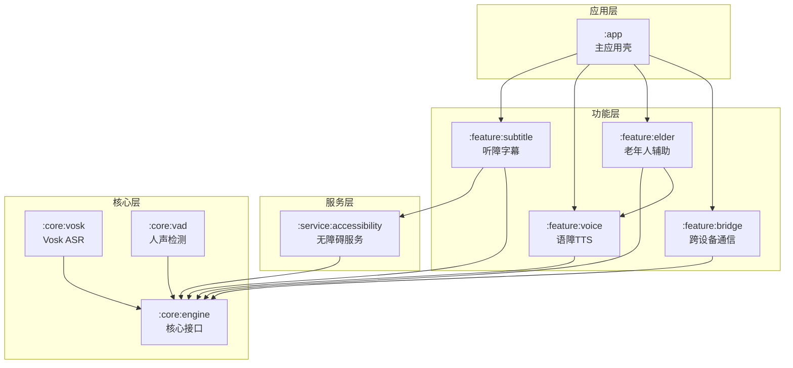
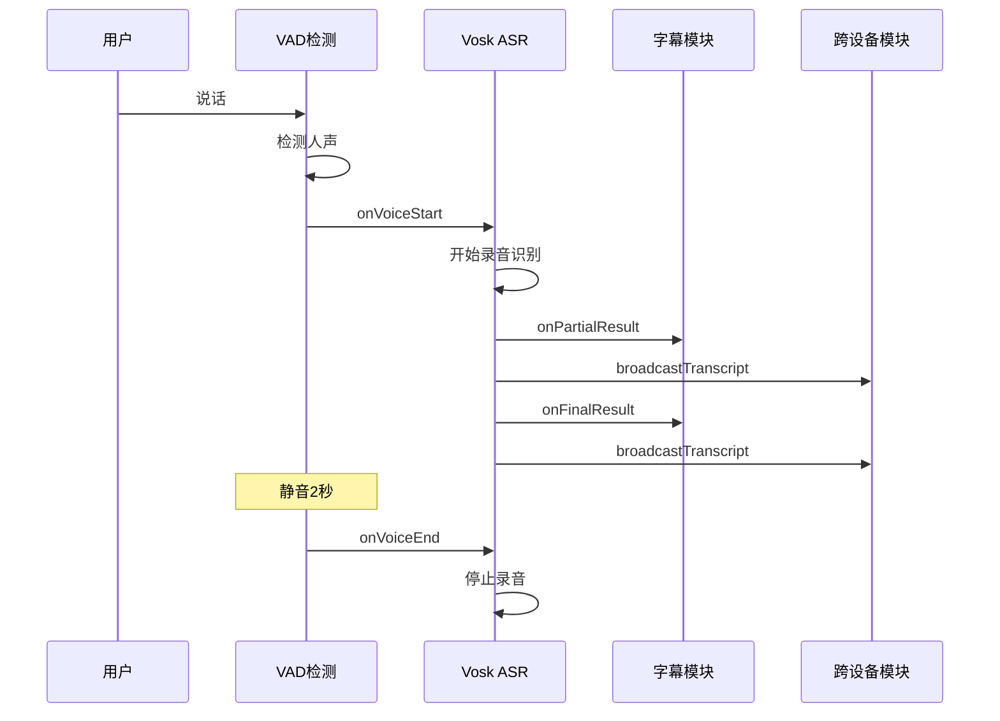

# Android 无障碍辅助工具 - 架构文档

## 项目概述

本项目是一个面向听障、语障及老年人群体的 Android 无障碍辅助工具，提供实时字幕、语音辅助、服药提醒、紧急呼叫等功能。

## 架构设计原则

1. **模块化设计**：采用多模块 Gradle 项目，各模块独立可编译
2. **接口驱动**：核心功能通过接口定义，支持可插拔实现
3. **本地优先**：所有处理在设备本地完成，保护用户隐私
4. **分层架构**：清晰的层次划分，便于维护和扩展

## 模块结构



## 模块详细说明

### 1. :core:engine - 核心引擎层

定义所有核心接口和数据模型：

- **AsrEngine** - 语音识别引擎接口
- **TtsEngine** - 语音合成引擎接口
- **VadDetector** - 人声检测接口
- **TranscriptResult** - 转写结果数据模型
- **VadEvent** - VAD事件数据模型
- **AppConfig** - 应用配置数据模型

### 2. :core:vosk - Vosk ASR 实现

实现 `AsrEngine` 接口，集成 Vosk Android SDK：

- 支持中文模型加载
- 从 assets 或用户指定路径加载模型
- 实时部分结果和最终结果回调

### 3. :core:vad - VAD 人声检测实现

实现 `VadDetector` 接口：

- 基于 AudioRecord 的低采样率（16kHz）持续监听
- 基于短时能量 + 过零率的基础 VAD 算法
- 检测人声开始/结束事件

### 4. :service:accessibility - 无障碍服务

继承 `AccessibilityService`：

- 监听所有类型的无障碍事件
- 获取界面元素标签
- 与 TalkBack 共存，补充缺失标签的朗读

### 5. :feature:subtitle - 听障字幕模块

MVP 核心功能：

- VAD 检测到人声 → 触发 ASR → 悬浮窗显示字幕
- 支持一键暂停/恢复
- 字幕历史（仅本次会话）

### 6. :feature:voice - 语障 TTS 模块

语音辅助功能：

- 用户输入文字 → 系统 TTS 朗读
- 预设常用短语快捷按钮
- 支持调整语速和音调

### 7. :feature:elder - 老年人辅助模块

- 服药提醒：定时任务 + TTS 朗读 + 通知
- 一键呼叫：悬浮球长按 → 拨打预设联系人

### 8. :feature:bridge - 跨设备通信模块

- 内嵌 WebSocket Server
- ASR 转写结果实时广播
- PC 浏览器打开局域网地址即可看到字幕

### 9. :app - 主应用壳

- 依赖所有 feature 模块
- 统一启动器 + 设置页面 + 模块开关

## 数据流



## 技术栈

- **语言**：Kotlin（核心模块）+ Java（部分底层接口）
- **最低 SDK**：Android 10 (API 29)
- **目标 SDK**：Android 14 (API 34)
- **构建系统**：Gradle Kotlin DSL
- **依赖库**：
  - Vosk Android SDK（语音识别）
  - Java-WebSocket（跨设备通信）
  - AndroidX Lifecycle（架构组件）
  - WorkManager（后台任务）

## 扩展点

1. **ASR 引擎替换**：实现 `AsrEngine` 接口即可替换为 Whisper 等
2. **TTS 引擎替换**：实现 `TtsEngine` 接口即可替换为自定义引擎
3. **VAD 算法升级**：可替换为基于 ML 的 VAD 模型
4. **新功能模块**：按需添加新的 feature 模块

## 构建说明

```bash
# 克隆项目
git clone https://github.com/your-org/android-accessible-toolkit.git

# 用 Android Studio 打开项目
# 或命令行构建
./gradlew assembleDebug
```